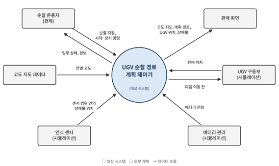

# 2.5D 지형 기반 UGV 순찰 경로 계획 제어기

[과제1: 프로젝트 관리] 범위 정의(Scope Definition), 이해관계자 및 대상 시스템 분석

---

## 1단계: 대상 제어기 선택

- **제어기 이름:** UGV 순찰 경로 계획 제어기 (Patrol Path Planning Controller)
- **역할:** 고도 정보가 있는 2.5D 격자 지형에서 순찰 지점의 방문 순서를 정하고, 각 지점까지의 경로를 A\* 알고리즘으로 생성한다. 순찰 중 새 장애물이나 배터리 부족 상황이 발생하면 경로나 임무를 다시 계획한다.
- **제어 계층:** 자율주행 UGV의 계획 구조(전역 경로계획 → 지역 경로계획 → 구동 제어) 중 전역 경로계획과 임무 관리 계층을 대상으로 한다.
- **선정 이유:** 지상 무인체계의 핵심 기술인 경로계획을 다루며, 하드웨어 없이 SILS(Software-in-the-Loop Simulation) 수준에서 알고리즘을 검증할 수 있다. 또한 인식·계획·임무 관리·구동을 ROS 2 노드로 분리하면 실제 무인체계의 소프트웨어 구조를 그대로 경험할 수 있다.

---

## 2단계: 프로젝트 범위 정의

### 2.1 프로젝트 목표

1. 2.5D 격자 지형에서 등판 한계를 넘는 경사를 피하는 순찰 경로를 생성한다.
2. 감시 공백이 가장 긴 지점을 우선 방문하여 순찰 지점 간 감시가 고르게 이루어지도록 한다.
3. 순찰 중 새 장애물이 감지되면 경로를 다시 계산한다.
4. 배터리가 부족해지면 순찰을 중단하고 기지로 복귀한다.
5. 인식·계획·임무 관리·구동·표시 기능을 ROS 2 노드로 분리하고, 노드 간 데이터를 토픽(발행-구독)으로 주고받는다.

### 2.2 범위 포함 사항

**[필수 구현]**

| 항목 | 내용 |
|---|---|
| 지도 데이터 | 공개 DEM(수치표고모델, SRTM 등)에서 구역을 잘라 N×N 격자 고도 지도로 사용한다(기본 100×100, 설정 가능). 장애물은 DEM에 없으므로 시험 상황에 맞게 코드로 추가한다. |
| 지형 경로 계획 | N×N 격자 지도(칸마다 고도, 장애물 여부)에서 A\* 알고리즘(4방향 이동)으로 경로를 생성한다. 등판 한계를 넘는 경사는 통행 불가로, 그 이하는 경사에 비례해 이동 비용을 높게 처리한다. |
| 순찰 순서 결정 | 마지막 방문 이후 가장 오래 지난 지점을 다음 목표로 정한다(최장 대기 우선). 가까운 지점만 반복 방문하여 먼 지점이 방치되는 문제를 막기 위함이다. |
| 장애물 재계획 | 센서 범위 안에서 새 장애물이 감지되어 경로가 막히면 현재 위치에서 경로를 다시 계산한다. |
| 배터리 복귀 | 기지 복귀에 필요한 에너지가 부족해지기 전에 순찰을 중단하고 복귀한다. |
| ROS 2 노드 구조 | 제어기와 시뮬레이션 요소(인식 센서, 배터리 관리, UGV 구동부)를 각각 ROS 2(rclpy) 노드로 구현하고, 토픽으로 데이터를 주고받는다. |
| 시각화 | 고도를 색의 명암으로 표시한 2D 격자 화면(OpenCV)에 경로, UGV 위치, 장애물을 표시하고, 같은 정보를 RViz2에서도 확인할 수 있도록 마커로 발행한다. |

**[선택 구현 (일정 여유 시)]**

- 포장로, 풀숲, 진흙 등 지형 유형별 이동 비용 차등 적용
- 최근 지나간 칸에 벌점을 주어 순찰 경로 다양화
- 통신 두절 시 정지 대기, 목표 지점 차단 시 건너뛰고 보고

### 2.3 범위 제외 사항

- 차량 동역학, 저수준 모터 제어, 지역 경로계획 (UGV는 칸 하나를 차지하는 점으로 가정)
- 실제 센서 연동, 딥러닝 기반 객체탐지, SLAM
- 이동 물체(보행자, 차량) 회피 및 적 노출 구역 고려
- 다중 UGV 협동 및 군집제어
- 터널 등 3차원 구조 표현
- Gazebo 등 물리 시뮬레이터 연동 (UGV 구동부는 단순 이동 모델로 대체)

---

## 3단계: 시스템 문맥도 및 이해관계자 분석

### 3.1 시스템 문맥도

*그림 1. UGV 순찰 경로 계획 제어기 시스템 문맥도 (○ 대상 시스템, □ 외부 개체, → 데이터 흐름)*

| 외부 개체 | 제어기로 들어오는 데이터 (입력) | 제어기에서 나가는 데이터 (출력) |
|---|---|---|
| 순찰 운용자 (관제) | 순찰 지점 지정, 시작·정지 명령 | 임무 상태, 경보 |
| 고도 지도 데이터 | 칸별 고도 | |
| 인식 센서 (시뮬레이션) | 센서 범위 안의 장애물 위치 | |
| 배터리 관리 (시뮬레이션) | 배터리 잔량 | |
| UGV 구동부 (시뮬레이션) | 현재 위치 | 다음 이동 칸 |
| 관제 화면 | | 고도 지도, 계획 경로, UGV 위치, 장애물 |

그림의 인식 센서, 배터리 관리, UGV 구동부는 각각 별도의 ROS 2 노드로 구현하여 토픽으로 제어기와 연결한다. 고도 지도는 시작 시 파일에서 읽고, 관제 화면은 OpenCV 창과 RViz2로 구성한다.

### 3.2 이해관계자 분석 (사용자 측면)

| 이해관계자 | 유형 | 역할 및 관심사 |
|---|---|---|
| 순찰 운용자 | 직접 사용자 | 순찰 지점 설정과 임무 시작·중지를 담당하며, 설정이 쉽고 이상 상황이 즉시 보고되는지를 중시한다. |
| 관제 지휘관 | 직접 사용자 | 순찰 상황을 감시·판단하며, 모든 지점이 고르게 감시되는지를 중시한다. |
| 정비·개발자 | 간접 사용자 | 기능 유지보수와 개선을 담당하며, 모듈 교체와 설정값 조정이 쉬운지를 중시한다. |
| 시험평가 담당자 | 간접 사용자 | 요구사항 충족 여부를 검증하며, 상황별 대응을 재현하고 확인할 수 있는지를 중시한다. |

---

## 4단계: 제약사항 조사

### 4.1 시스템 제약사항

수치는 모두 가정값이며 구현 시 설정값으로 조정한다.

| 구분 | 제약사항 |
|---|---|
| 기동 성능 | 최대 등판각 30°를 넘는 경사는 통행 불가. 칸 크기를 약 30m(SRTM 해상도)로 보면, 인접 칸의 고도차가 약 17m를 넘는 이동이 통행 불가 |
| 지도 규모 | 기본 100×100 격자(약 3km × 3km). 재계획 시간을 성능 시험에서 측정하여 규모를 조정 |
| 인식 | 센서는 UGV 주변 일정 반경(기본 3칸) 안의 장애물만 감지 |
| 실시간성 | 새 장애물 감지 후 0.5초 이내 재계획 완료 (목표치) |
| 에너지 | 이동 거리와 경사에 비례해 소모되며, 기지 복귀 에너지에 여유분(기본 20%)을 항상 확보 |

### 4.2 프로젝트 제약사항

| 구분 | 제약사항 |
|---|---|
| 인력·기간 | 1인 개발, 2학기 종강 전까지 목표 |
| 검증 환경 | 실제 차량 없이 시뮬레이션으로만 검증 |
| 개발 환경 | Windows 11 + WSL2(Ubuntu), ROS 2(rclpy), RViz2, Python(NumPy, OpenCV, Matplotlib), pytest. VS Code에서 WSL 확장으로 개발 |
| 비용 | 모두 무료 오픈소스 도구만 사용 |

### 4.3 프로젝트 위험 및 대응

| No. | 위험 | 치명도 | 발생 빈도 | 대응 |
|---|---|---|---|---|
| 1 | 구현 지연 | High | Mid | 필수 구현 항목부터 진행하고, 선택 구현 항목은 향후 확장으로 넘긴다. |
| 2 | 비용 설정 오류로 비현실적인 경로 생성 | Mid | Mid | 가중치를 설정값으로 분리해 시험하고, 필요 시 비용 항목을 거리와 경사로만 축소한다. |
| 3 | ROS 2 환경 구축과 학습이 예상보다 오래 걸림 | Mid | Mid | 구현 첫 단계에서 WSL2와 ROS 2 설치, 간단한 발행-구독 예제부터 확인한다. 그래도 어려우면 노드 구조 대신 Python 모듈과 자체 메시지 버스(발행-구독)로 대체한다. |

---

## 5단계: 프로젝트 규모 산정

### 5.1 LOC 기법

추정 LOC = (낙관치 + 4 × 기대치 + 비관치) / 6

| 모듈 | 낙관치 | 기대치 | 비관치 | 추정 LOC |
|---|---|---|---|---|
| 지형 지도 및 비용 모델 | 70 | 110 | 170 | 113.3 |
| A\* 경로 계획 및 재계획 | 50 | 70 | 100 | 71.7 |
| 순찰·임무 관리 (순찰 순서, 배터리 복귀) | 60 | 90 | 130 | 91.7 |
| 시뮬레이션 노드 (인식·배터리·UGV 구동부) | 60 | 90 | 130 | 91.7 |
| ROS 2 노드 구성 및 토픽 인터페이스 (launch 포함) | 40 | 60 | 90 | 61.7 |
| 시각화 (OpenCV 화면, RViz2 마커) | 70 | 100 | 150 | 103.3 |
| **합계** | | | | **약 533 LOC (0.53 KDSI)** |

### 5.2 기능점수(FP) 기법

ROS 2 노드 구조는 같은 기능을 구현하는 방식의 차이이므로 식별되는 기능의 수는 달라지지 않는다. 따라서 기능점수와 개발비는 그대로 두고, 노드 구성에 드는 노력은 LOC와 일정에 반영했다.

**(1) 기능 식별**

| 유형 | 기능 |
|---|---|
| ILF (내부 논리 파일) | 순찰 지점 정보, 장애물 지도 |
| EIF (외부 인터페이스 파일) | 고도 지도 데이터, 배터리 상태 정보 |
| EI (외부 입력) | 순찰 지점 등록·수정, 임무 시작·정지 명령, 장애물 감지 입력, UGV 위치 입력 |
| EO (외부 출력) | 순찰 경로 출력, 이동 명령 출력, 경보 출력, 상황 지도 출력 |
| EQ (외부 조회) | 순찰 지점 상태 조회, UGV 상태 조회 |

**(2) 미조정 기능점수 (기능 수 × 평균 복잡도)**

| 구분 | 유형 | 기능 수 | 평균 복잡도 | 점수 | 소계 |
|---|---|---|---|---|---|
| 데이터 기능 | ILF | 2 | 7.5 | 15.0 | 25.8 |
| | EIF | 2 | 5.4 | 10.8 | |
| 트랜잭션 기능 | EI | 4 | 4.0 | 16.0 | 44.6 |
| | EO | 4 | 5.2 | 20.8 | |
| | EQ | 2 | 3.9 | 7.8 | |
| **합계** | | | | | **70.4 FP** |

**(3) 보정 전 개발 원가**

70.4 FP × 605,784원 (2024년 기능점수당 단가) ≈ 42,647,194원

**(4) 보정 후 개발 원가**

| 보정 요인 | 선택 수준 | 계수 |
|---|---|---|
| 규모 보정 | 500FP 미만 | 1.28 |
| 연계 복잡성 | 상위 관제 체계 1~2개 연계 | 0.94 |
| 성능 요구 | 처리 시한 명시 | 1.05 |
| 운영환경 호환성 | 요구사항 없음 | 0.94 |
| 보안성 | 1가지 보안 요구사항 | 0.97 |
| **보정 계수 곱** | | **≈ 1.152** |

보정 후 개발 원가 ≈ **49,126,667원**

**(5) 소프트웨어 개발비 (산정값이며 실제 지출이 아님)**

외주로 개발할 경우의 시장 가격을 기능점수 방식으로 환산한 참고값이다. 본 프로젝트는 직접 개발하고 도구도 모두 무료이므로 실제로 쓰는 돈은 0원이다.

| 항목 | 금액 |
|---|---|
| 보정 후 개발 원가 | 49,126,667원 |
| 이윤 (25%) | 12,281,667원 |
| 직접 경비 | 0원 |
| **소프트웨어 개발비** | **61,408,334원 (약 6,141만 원)** |

### 5.3 산정 결과의 적용

- **실제 지출 비용: 0원.** 직접 개발하고 모든 도구가 무료 오픈소스이므로 돈이 들지 않는다.
- 기능점수 개발비(약 6,141만 원)는 품질 보증, 형상 관리 등 상용 SW의 전체 생명주기 활동을 포함한 단가로 계산한 값이다. 이 프로젝트를 외주나 상용 제품으로 개발한다고 가정했을 때의 규모를 가늠하는 참고값으로만 쓴다.
- 본 프로젝트의 일정은 작업별 상향식 추정(39시간)을 기준으로 관리한다.

---

## 6단계: 주요 업무 구분 및 WBS 연계

1일 작업량은 4시간 기준이며, 모든 작업의 작업자는 본인이다. 이번 과제1에서 수행한 작업은 "완료"로 표시했다.

| 작업번호 | 작업 이름 | 기간(일) | 상태 | 연계 |
|---|---|---|---|---|
| **1** | **프로젝트 관리 및 요구 분석** | **1.5** | | |
| 1.1 | 범위 정의 | 0.75 | 완료 | 2단계 |
| 1.2 | 시스템 문맥도 및 이해관계자 분석 | 0.25 | 완료 | 3단계 |
| 1.3 | 제약사항 조사 | 0.25 | 완료 | 4단계 |
| 1.4 | 규모 산정 및 일정 계획 | 0.25 | 완료 | 5·6단계 |
| **2** | **설계** | **1.0** | | |
| 2.1 | 모듈 구조 및 토픽 인터페이스 설계 | 0.5 | 예정 | 3단계 |
| 2.2 | 비용 모델 및 임무 상태 전환 설계 | 0.5 | 예정 | |
| **3** | **구현** | **5.5** | | 5.1 LOC 모듈 |
| 3.1 | 개발 환경 구축 (WSL2, ROS 2, RViz2) | 0.5 | 예정 | 4.3 위험 3 |
| 3.2 | 지형 지도(DEM 전처리 포함) 및 비용 모델 | 1.0 | 예정 | |
| 3.3 | A\* 경로 계획 및 재계획 | 0.75 | 예정 | |
| 3.4 | 순찰·임무 관리 | 0.75 | 예정 | |
| 3.5 | ROS 2 노드 구성 및 토픽 인터페이스 | 0.75 | 예정 | |
| 3.6 | 시뮬레이션 노드 (인식·배터리·UGV 구동부) | 0.75 | 예정 | |
| 3.7 | 시각화 (OpenCV, RViz2) | 1.0 | 예정 | |
| **4** | **시험** | **1.0** | | |
| 4.1 | 단위 시험 (pytest) | 0.5 | 예정 | |
| 4.2 | 상황별 시나리오 시험 | 0.5 | 예정 | 2단계 |
| **5** | **문서화** | **0.75** | | |
| 5.1 | 보고서 및 시연 자료 작성 | 0.75 | 예정 | |
| | **합계** | **9.75일 (39시간)** | | |

---

## 향후 확장 방향

- **재계획 효율화:** A\*를 D\* Lite로 바꾸어 장애물이 바뀐 부분만 갱신한다.
- **기능 확장:** 선택 구현 항목을 추가하고, 사전 지도 대신 SLAM 기반 지도를 사용한다.
- **플랫폼 확장:** 성능이 필요한 모듈을 C++17로 이식하고, UGV 구동부를 Gazebo 시뮬레이션으로 교체한다.
- **검증 확대:** Nav2의 Smac Planner 결과와 비교하여 경로 품질을 검증한다.
